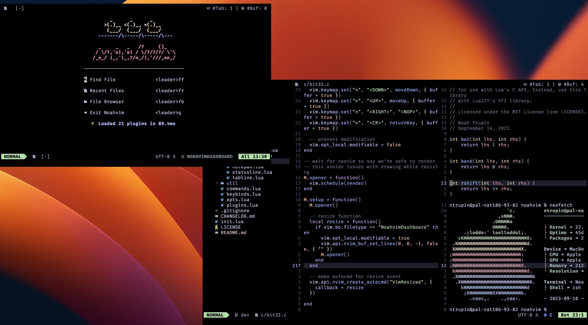

# Noahvim



My Neovim configuration.

## Dependencies

- `git` for updates
- `bash` or any POSIX-compliant shell
- `npm` and `gcc` for language servers
- a truecolor/24-bit-color terminal emulation
- Neovim > 0.8.0
- a patched font (such as a [NerdFont](https://nerdfonts.com))

## Installation

1. clone the respository into the nvim config dir
    ```bash
    git clone https://github.com/ntrupin/noahvim ~/.config/nvim
    ```
2. build the necessary c libs
    ```bash
    mkdir -p build
    gcc -shared -o build/bit32.so -fPIC bit32.c
    ```


## Features

- Improved yank/paste functionality with Telescope
- Telescope buffer selection, file browsing, grepping, and more
- LaTeX compilation with Vimtex
- Error-reporting tabs with bufferline
- Feature-rich statusline
- Improved highlighting and searching with Tree-sitter
- Fully-featured LSP with auto-completion, documentation, error detection, and more
- Intuitive keybinds
- Stylish notifications with Notify
- Color highlighting with Colorizer
- Git indicators with gitsigns
- A scratchpad for in-session note-taking.

## Inspirations

- [LazyVim/LazyVim](https://github.com/LazyVim/LazyVim)
- [theopn/theovim](https://github.com/theopn/theovim)
- [amix/vimrc](https://github.com/amix/vimrc)
